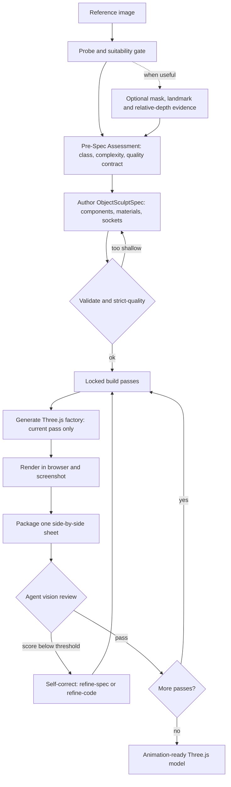

# Architecture

The full mechanism behind img2threejs: how the staged pipeline runs, why it stays token-efficient, what each script does, and what artifacts you get out the other end. The [README](../README.md) covers the pitch and quick start; this doc covers how it actually works.

---

## Pipeline overview

The skill runs a staged sculpting pipeline. Scripts gate each stage; the agent's vision is the only thing that can approve a pass.



### Material reference hand-off

Material identity is an executable sub-pipeline rather than prose in the spec:

```text
named component region
  -> verified crop + observation
  -> material-reference.json resolver
  -> reference-derived PBR maps and bounded prior
  -> ObjectSculptSpec materialReference/materialPipeline
  -> generated material userData and color-space-safe maps
  -> multi-angle zoom/microscope capture
  -> per-region comparator and bounded feedback
  -> materialGate + material-pass unlock
```

`forge/materials/reference.py` is the runtime registry contract. The registry never decides from
colour alone and an ambiguous or low-confidence region remains `probe`/`request-input`. The
material gate also checks that UV/map bindings survive geometry, visual hull, skinning, collision,
morph and LOD changes. Existing specs without `materialPipeline` remain backward-compatible.

### Build passes

The model is sculpted in a fixed order; a pass unlocks only after the previous one is reviewed and accepted:

`blockout → structural-pass → form-refinement → material-pass → surface-pass → lighting-pass → interaction-pass → optimization-pass`

Each pass has its own acceptance criteria. A pass is marked `continue` only with a real render, a comparison sheet, an agent-vision score at or above threshold, and every identity-defining feature at or above its own threshold.

For resumable work, `forge/state.py` stores an atomic JSON checklist around this pipeline. Profile
steps for `character` and `cs2` are inserted before local spec authoring; correction counts are
bounded per pass and globally. `forge/next.py --state` reports the next ordered action and rejects
a positional spec that differs from the state artifact. This state index does not grant a pass:
the ObjectSculptSpec, render evidence, review history, and deterministic gates still decide.

### The gates

- **Suitability** — is the image a viable 3D target at all.
- **Pre-spec and strict-quality** — blocks code generation until the spec is deep enough for the object's complexity (no single-root spec for a compound object).
- **Screenshot feedback** — `continue` requires a render plus a comparison sheet plus a passing vision score.
- **Action-ready** — the model exposes a runtime hierarchy (pivots, sockets, colliders, destruction groups) via `root.userData.sculptRuntime`.
- **Attachment correctness** — child parts (handles, limbs, tubes) declare how they join their parent, so nothing floats in mid-air.
- **Material and lighting realism** — independent PBR channels and real lights, never albedo aliased into roughness.

### Self-correction

After every pass the agent chooses exactly one action: `continue`, `refine-spec`, `refine-code`, `request-input`, or `stop`. `refine-spec` fixes a wrong or shallow spec and re-validates; `refine-code` fixes geometry, material, or lighting that does not match a sound spec.

---

## Why it is token-efficient

Most image-to-3D agent loops burn tokens by asking the model to do mechanical work — re-reading the whole model every pass, scoring pixels, validating JSON by hand, re-running steps it already did. img2threejs pushes all of that into deterministic scripts and spends model tokens only where judgment is actually required.

- **Scripts enforce, the model judges.** The Python scripts handle validation, gating, spec authoring, PBR extraction, comparison-sheet packaging, and pipeline state. They never score visuals. The model's tokens go to one thing: looking at a single side-by-side sheet and deciding pass or fail.
- **Zero dependencies, zero install churn.** Every script is pure Python 3.10+ standard library. No pip, no PIL, no numpy, no Playwright. PNG read/write is done with `struct` and `zlib`. Nothing to install means nothing to debug in-context.
- **Pass-gated generation.** The code generator emits only the currently unlocked build pass. The model does not regenerate or re-read the entire model on every iteration — each step is small and scoped.
- **Fail fast, before codegen.** A strict-quality gate blocks shallow specs before a single line of Three.js is generated, so you never spend tokens rendering a model that was underspecified from the start.
- **One image per review.** Each pass is judged from exactly one packaged comparison sheet (reference beside render), not a scattering of screenshots.
- **Text output, not binaries.** The result is diffable TypeScript plus a JSON spec — small, reviewable, and version-controllable, instead of multi-megabyte mesh files.

The net effect: you still get a faithful 3D model from an image, but the expensive model context is reserved for visual judgment and code, not bookkeeping. For the full per-stage and per-cycle token breakdown, see [TOKEN_COST.md](TOKEN_COST.md).

---

## Scripts

| Script | Role |
| --- | --- |
| `stage1_intake/probe_image.py` | Image metadata and obvious technical issues (not a visual check). |
| `stage1_intake/probe_glb.py` | GLB provenance, bounds, scene inventory and conservative semantic-readiness assessment. |
| `stage2_spec/new_pre_spec_assessment.py` | Classify the object, score complexity, emit a quality contract. |
| `stage2_spec/new_sculpt_spec.py` | Author the ObjectSculptSpec from the assessment. |
| `stage2_spec/validate_sculpt_spec.py` | Validate the spec; `--strict-quality` blocks shallow specs before codegen. |
| `stage1_intake/extract_pbr_evidence.py` | Reference-derived PBR evidence per crop (inference, not inverse rendering). |
| `stage1_intake/material_region_analysis.py` | Region crop admission, PBR extraction, and material-reference resolution. |
| `stage2_spec/apply_material_analysis.py` | Material analysis to ObjectSculptSpec hand-off. |
| `stage3_build/orchestrate_passes.py` | Locked pass state: status, check, sync. |
| `stage3_build/generate_threejs_factory.py` | Emit the Three.js `Group` factory for the current unlocked pass. |
| `stage4_review/make_comparison_sheet.py` | Package one reference-vs-render sheet for review. |
| `stage4_review/append_review.py` | Record a per-pass review: scores, decision, evidence. |
| `stage4_review/material_views.py` | Deterministic material camera/crop/microscope plan and capture readback validation. |
| `stage4_review/material_comparator.py` | Per-region crop metrics and mismatch tags. |
| `stage4_review/material_gate.py` | Blocking material acceptance and cross-pass compatibility gate. |
| `stage4_review/validate_render_profile.py` | Validate the shared GLB/procedural renderer, camera and six-pass profile. |
| `stage4_review/compare_region_passes.py` | Compare paired browser diagnostic passes and block unsupported per-region claims. |
| `stage4_review/cs2_review.py` | Evaluate the blocking CS2 knife review contract and versioned scene thresholds. |
| `_shared/feature_acceptance_policy.py` | Internal helper enforcing per-feature score thresholds. |
| `stage1_intake/build_detail_inventory.py` | Slice the reference into zones and scaffold a detail inventory. |
| `stage1_intake/extract_landmarks.py` | Overlay a landmark grid and scaffold an anatomy block for characters. |
| `stage1_intake/solve_camera_pose.py` | Emit a reference-camera block so the render can be camera-matched. |
| `stage1_intake/delight_albedo.py` | Approximate a neutral albedo from the photo before texture projection. |
| `stage1_intake/run_vision_adapter.py` | Invoke optional isolated SAM2, MediaPipe, and Depth Anything evidence adapters. |
| `stage3_build/bake_projected_texture.py` | Emit a projection/UV-bake descriptor for photo-texture projection. |

The `grimoire/` folder holds the detailed rubrics each gate applies (validation, pre-spec assessment, procedural patterns, material and lighting realism, attachment correctness, action-ready models, self-correction).

---

## What you get

- An `ObjectSculptSpec` JSON: the full component tree, materials, repetition systems, sockets, and a recorded review history for every pass.
- A TypeScript `createObjectNameModel(spec, options)` factory returning a `THREE.Group`, with `root.userData.sculptRuntime` exposing nodes, sockets, colliders, and destruction groups.
- A render plus comparison sheets documenting the fidelity at each pass.
